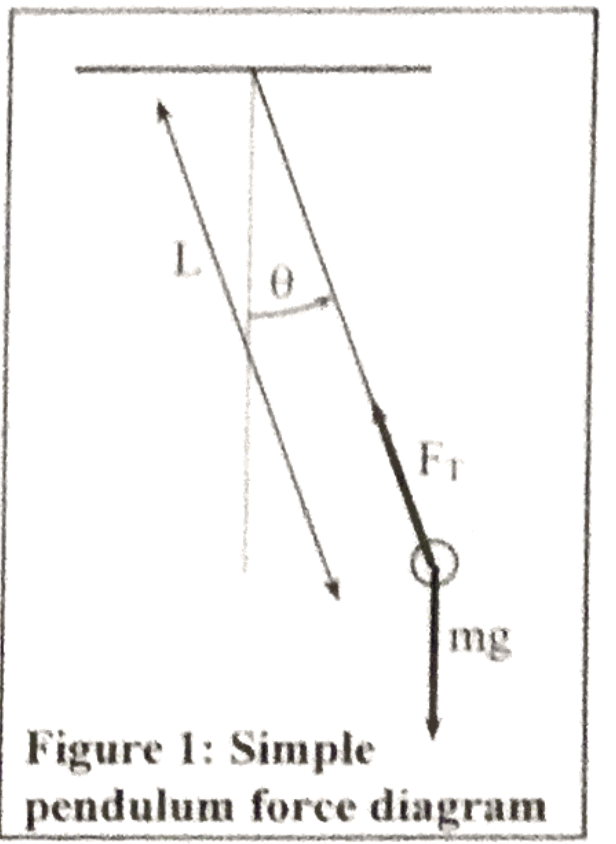
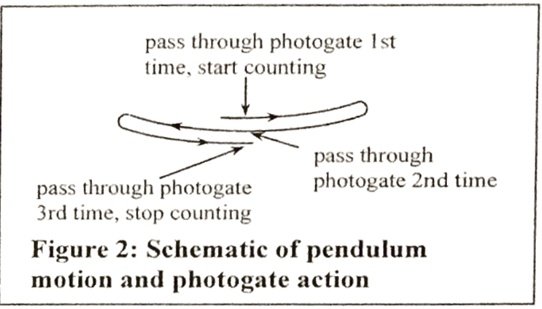

```{r setup, include=FALSE}
knitr::opts_chunk$set(echo = TRUE)
```

##Abstract:
***

In this labortory, I investigated the effect of non-small amplitude for a simple pendulum. I made a model on RStudio to model the motion, and used to find the approximated period of oscillation for different amplitudes. These values were compared to an actual period of oscillation which was measured by a photogate with a real pendulum.

##Theory:
***

Equation of a pendulum with small oscillation:

\begin{align*}
  T = 2 \pi \sqrt{\frac{L}{g}} 
\end{align*}

From the torque equation, I get these 3 equations:

\begin{align}
  \tau = I*\alpha \\
  -mgL\sin(\theta) = mL^2\alpha \\
  \alpha = -\frac{g}{L}\sin(\theta) \\
\end{align}

From these 3 independent equations we can get:

\begin{align}
  \frac{d^2\theta}{dt^2} = -\frac{g}{L}\sin(\theta)
\end{align}

However it is currently impossible to use equation (4) to predict the movement of the pendulum, instead I will use Euler's method to approximate numerical values of $\omega$ and $\theta$, which is:

\begin{align}
  \omega(\Delta t) &= \omega(0) + \Delta t*\alpha(0) \\
  \theta(\Delta t) &= \theta(0) + \Delta t*\omega(\Delta t)
\end{align}

The value of $\Delta t$ cannot be measurable. It is a numerical kludge where I choose the value to be small or big, with a tradeoff. If the value of $\Delta t$ is small, solutions are accurate, but I may need to do many calculations to get a result. If the value of $\Delta t$ is big, solutions are less accurate, but quicker to calculate.

By combining equation (3) and (5), I can get:

\begin{align}
  \omega(\Delta t) = \omega(0) - \Delta t*\frac{g}{L}\sin(\theta)
\end{align}

By generalizing these relationships:

\begin{align}
  \theta(t+\Delta t) &= \theta(t) +\Delta t*\omega(t+\Delta t) \\
  \omega(t+\Delta t) &= \omega(t) -\Delta t*\frac{g}{L}\sin(\theta(t))
\end{align}

To compare to the small angle approximation (where period is independent of amplitude), it is useful to define the dimensionless quantity

\begin{align}
  \gamma = \frac{T_{\text{numerical}}}{T_{\text{small angle}}} = 
   \frac{T_{\text{apx.}}}{2 \pi \sqrt{\frac{L}{g}}} 
\end{align}

##Procedure:
***


###Set Up:

By using a string, clamps, rod, and pendulum mass, I was able to make a simple pendulum as shown in **Figure 1**.

\begin{center}
```{r,out.height="6cm",echo=FALSE}

```
\end{center}


###Measuring Actual Period of Oscillation:

I measured the length of the string and recorded it. Then I recorded actual value of period of oscillation by using the photogates and photogate timer as shown in **Figure 2**.


\begin{center}
```{r,out.height="7cm",echo=FALSE}

```
\end{center}

###Approximating Period of Oscillation:

I inputed the data in Microsoft Excel to make a data table which will approximate the period of oscillation. In the data table, I made 3 columns called "Times(s)", "$\theta$(rad)", and "$\omega$(rad/s)". 

\

For "Time" section, I chose $\Delta t$ as 0.05 sec and modeled the value from 0 sec to 2.5 sec.

\

For "$\theta$" section, I put in the $\theta$ value I want for my simple pendulum. For the rest of the value, I used the equation (8) in theory section to approximate the $\theta$ value after the initial value.

\

Lastly, for "$\omega$" column, I put in non-zero for the first value on *Case 1* of *Data and Calculations* because if $\omega$ value was 0 in case 1, the pendulum would not move. I put in 0 for the first value in *Case 2* of *Data and Calculations* because it was at it's highest point and not moving. For the rest of the value, I used equation (9) in theory section to approximate the $\omega$ value after the initial value.

\

The MS Excel helped us calcualate all the values of $\theta$ and $\omega$ after the first column. Then I used MS Excel to draw a graph of "Time"" on x-axis and $"\theta"$ on y-axis to figure out the relationship between the two data sets.

\

By looking at this graph, I was able to get an approximated period of oscillation of my pendulum. 

###Comparing the Period of Oscillation with Different Cases

I compared my approximated period of oscillation and actual period of oscillation. After that, I changed my $\theta$ values(0.1 ,0.2 ,0.4 ,0.8 ,1.2) to see how the period changes as theta changes.

Then I inputed actual period of oscillation in equation (10) to get the $\gamma$ value. Then I saw how the $\gamma$ value changed as I changed the $\theta$ value. 

##Data and Calculations:
***

###Case 1: $\theta(0)$ = 0
<br>

The graph below shows the relationship between time and $\theta$ when initial $\theta$ = 0 and $\omega$ is not 0.

```{r,echo=FALSE, message=FALSE}
# message=FALSE suppresses information about the packages that are imported
#     (such as warnings that some names are being "shadowed" by importing packages that define the same functions)
library(pander)
library(ggplot2)
library(reshape2)
library(dplyr)
library(tidyr)

getTheta <- function(theta0, omega0, g,L, dt, endTime){
  nStep = endTime / dt
  theta = numeric(nStep)
  omega = numeric(nStep)
  
  theta[1] = theta0
  omega[1] = omega0
  for (i in 2:nStep){
    omega[i] = omega[i-1] - (g/L)*sin(theta[i-1])*dt
    theta[i] = theta[i-1] + omega[i]*dt
  }
  theta
}

dt = 0.005
tend = 2.5
Times <- seq(from = 0, to= tend - dt, by=dt)
Theta0.0 <- getTheta(theta0 = 0.0, omega0 = 0.33, g=9.81,L =0.896, dt = dt, endTime = tend)
table1 <- data.frame(Times, Theta0.0)
```

```{r, echo=FALSE,out.height="7cm", fig.align='center'}
ggplot(data = table1, aes(x = Times, y = Theta0.0)) + geom_point() +labs(title="Figure 3: Pendulum angle from equilbrium vs time for amplitude 0")
```


As shown in **Figure 3**, the graph looks very similar to the sine graph. By looking at when the graph's $y$ value goes to 0, I approximated the period for this case.

The approximated period of this case is 1.9 sec.

The actual period of this case is 1.897 sec by the photogate.

By equation (10), the $\gamma$ value is `r 1.897/(2*pi*sqrt(0.896/9.81))` which is close to 1.

###Case 2: Pendulum Released from Rest

For the remaining cases, I released the pendulum from its maximum amplitude rather than starting from $\theta = 0$. The advantages of this method was that it is easy to find the period in the simulation (by looking for a smallest time $t > 0$ that $\theta(t)$ reached a maximum), and the amplitude was experimentally easy to measure. The amplitudes $\theta_{\text{max}}$ investigated were 0.2, 0.4, 0.8 and 1.2 radians. The simulation values for each case were generated:
```{r, echo=FALSE}
Theta0.2 <- getTheta(0.2,0.0,g=9.81,L=0.896,dt=dt,endTime = tend)
Theta0.4 <- getTheta(0.4,0.0,g=9.81,L=0.896,dt=dt,endTime = tend)
Theta0.8 <- getTheta(0.8,0.0,g=9.81,L=0.896,dt=dt,endTime = tend)
Theta1.2 <- getTheta(1.2,0.0,g=9.81,L=0.896,dt=dt,endTime = tend)
```
The graph for each simulation has been plotted below. The period was determined by when the graph reached its new maximum value. The point used as the maximum is indicated with a black dot on each graph.

```{r, out.height="7cm", out.width="11cm", fig.align="center", echo=FALSE}
# First collect all calculations into one data frame. 
# Each column belongs to a different "experiment"/simulation
all_data = data.frame(Times,Theta0.2,Theta0.4,Theta0.8,Theta1.2)

# Use gather (from tidyr package) to make the each time 5 different entries (one for each amplitude)
all_data2 = gather(all_data, thetaAmplitude, Theta, -Times)
all_data2 = separate(all_data2, thetaAmplitude, into=c("Nothing","Amplitude"),sep="a")
# Drop the column "Nothing"
all_data2 = subset(all_data2, select= -c(Nothing))

# These are the periods that were obtained looking at the graphs
simulationPeriods = data.frame( periods = c(1.905,1.915,1.975,2.085), Amplitude=c(0.2,0.4,0.8,1.2))

# Now create the plot, eliminating the special case where the amplitude was 0
ggplot() + geom_point(data = all_data2, aes(x=Times, y=Theta,color=Amplitude),size=0.4) +
  labs(title="Figure 4: Pendulum angle from equilbrium vs time for different amplitudes", 
       x = "Time (s)", y = expression(theta (rad))) + 
  geom_point(data=simulationPeriods, aes(x=periods, y=Amplitude), size=1.2)
```

As shown in **Figure 4**, the approximated period of oscillation increased as the amplitude increased. I inputed the actual period of oscillation in to equation (10) to see how the $\gamma$ value changes as amplitude increases.

###Data Table for Period and Frequency for each case:

```{r, echo=FALSE}
Theta = c(0.1,0.2,0.4,0.8,1.2)

calculatedT = c(1.9,1.905,1.915,1.975,2.085)
actualT = c(1.8974,1.8993,1.9138,1.9748,2.04)

errorT = round(100*(actualT - calculatedT)/actualT,1)
gamma = round(actualT / (2*pi*sqrt(0.896/9.81)),2)
PeriodTable = data.frame(Theta,calculatedT,actualT,errorT, gamma)
names(PeriodTable) = c('Amplitude (rad)','Sim. Period (s)','Actual Period (s)','Error (%)', 'gamma')

```

```{r, echo=FALSE}
pander(PeriodTable)
```

##Analysis & Conclusions:
***

I was able to obtain period of oscillation both experimentally and theoretically by this lab, resulting small error percentage. As I shown in the data table, the gamma value was close to 1 when the $\theta$ value was relatively small. However as the amplitude increased, the $\gamma$ value started to increase and became bigger than 1. This means that the equation of a pendulum with small osciallation is a good approximation for small amplitudes, where small amplitudes are less than 0.2 radians

